# Fortigate Corporate Policies

Repositorio de evidencias y documentación del laboratorio de políticas corporativas en FortiGate Firewall.

**Estudiante:** Michael Robles  
**Matrícula:** 2025-0845  
**Tema:** Políticas en FortiGate Firewall, WAF, APP, DNS y DHCP

## Enlaces del proyecto

- Repositorio GitHub:  https://github.com/iClexi/Fortigate-Corporate-Policies
- Video demostrativo:  https://youtu.be/0reqS0mu2Xg?si=DVFub7pDGiVRa4Gi
- Documentación técnica profesional: [docs/Documentación Técnica Profesional.pdf](docs/Documentaci%C3%B3n%20T%C3%A9cnica%20Profesional.pdf)

## Estructura del repositorio

```text
Fortigate-Corporate-Policies/
├── README.md
├── docs/
│   └── Documentación Técnica Profesional.pdf
└── images/
    ├── 01_topologia_laboratorio.png
    ├── 02_ruta_estatica_default.png
    └── ...
```

## Objetivo

El objetivo del laboratorio es demostrar una configuración corporativa en FortiGate donde se separan usuarios, servidores e Internet, se habilita DHCP para usuarios, se permite acceso controlado hacia servicios web internos, se bloquean redes sociales, se bloquea itla.edu.do con sus subdominios, se controla WhatsApp VoIP, se detectan escáneres de red y se protege el servidor web con Web Application Firewall.

## Topología y alcance

### Topología del laboratorio


La topología presenta al FortiGate como dispositivo central entre Internet, la LAN de usuarios y la LAN de servidores. A la izquierda está el switch de usuarios con la estación Secretaria. A la derecha está el switch de servidores con el Web Server. También se muestra el nombre Michael Robles, la matrícula 20250845 y el alcance general de la práctica: WAF, APP, DNS y DHCP.

## Direccionamiento, rutas e interfaces

### Ruta estática por defecto

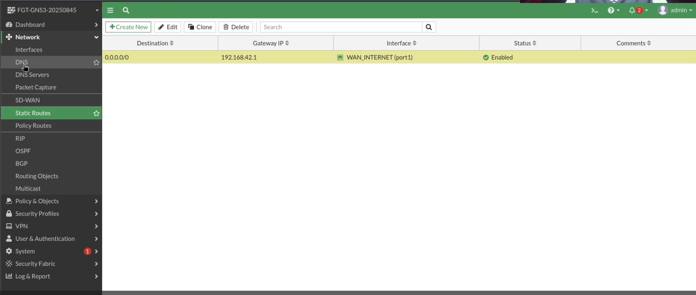

La ruta por defecto 0.0.0.0/0 apunta al gateway 192.168.42.1 mediante la interfaz WAN_INTERNET port1. Esta ruta permite que el FortiGate envíe hacia Internet todo tráfico cuyo destino no pertenezca a una red local conocida.

### Resumen de interfaces del FortiGate

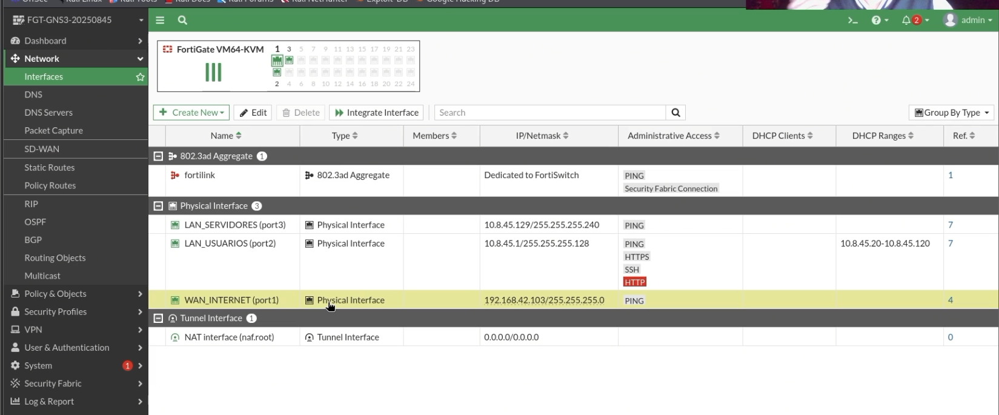

El panel de interfaces muestra las tres zonas del laboratorio: WAN_INTERNET en port1 con IP 192.168.42.103/24, LAN_USUARIOS en port2 con IP 10.8.45.1/25 y LAN_SERVIDORES en port3 con IP 10.8.45.129/28. También se observa el rango DHCP para usuarios de 10.8.45.20 a 10.8.45.120.

### Configuración de port2 como LAN de usuarios

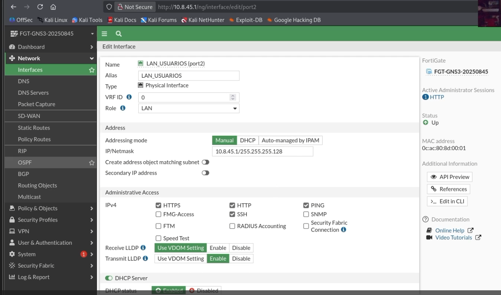

La interfaz LAN_USUARIOS port2 está configurada manualmente con 10.8.45.1/25. Esta dirección funciona como puerta de enlace de la red de usuarios 10.8.45.0/25. En el acceso administrativo se ven habilitados  , HTTP, SSH y PING para administración y pruebas internas del laboratorio.

## DHCP y resolución DNS

### DHCP en la LAN de usuarios


El servidor DHCP de port2 está habilitado con rango 10.8.45.20-10.8.45.120, máscara 255.255.255.128, puerta de enlace igual a la IP de la interfaz y DNS 10.8.45.1. Esto hace que los equipos de la LAN de usuarios reciban parámetros de red directamente desde el FortiGate.

## Políticas de firewall y segmentación

### Resumen de políticas de firewall

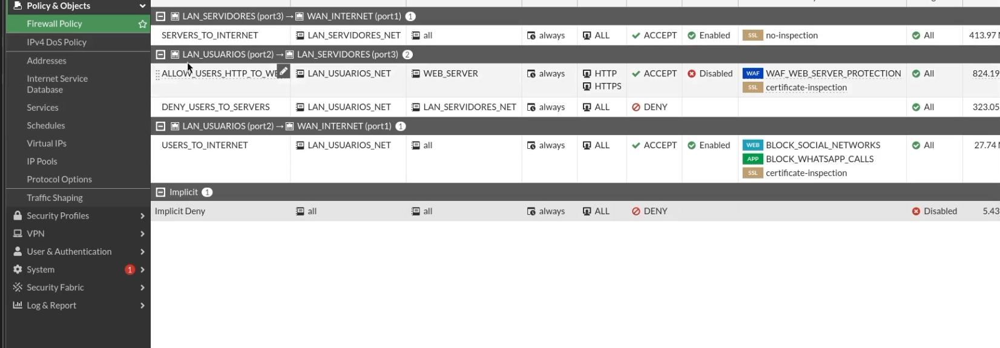

La vista general de políticas agrupa los flujos principales: servidores hacia Internet, usuarios hacia servidores y usuarios hacia Internet. Se observan las reglas de salida, la regla que permite tráfico web hacia el servidor y la regla que deniega el resto del tráfico desde usuarios hacia la red de servidores.

### Política de servidores hacia Internet

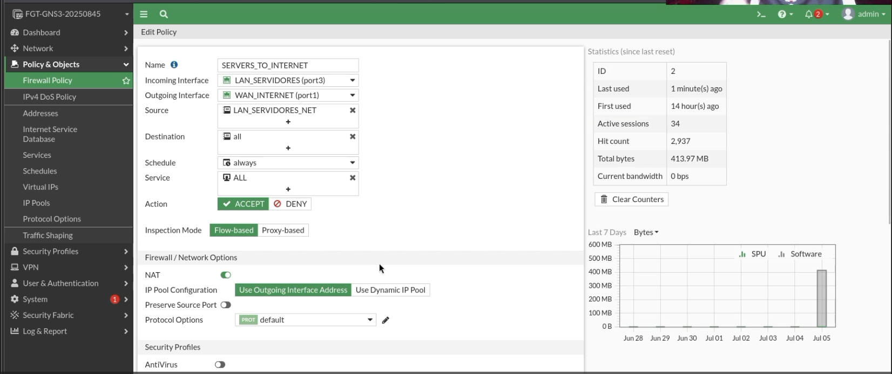

La política SERVERS_TO_INTERNET permite que LAN_SERVIDORES_NET salga hacia WAN_INTERNET. Usa destino all, servicio ALL y acción ACCEPT. También se observa NAT habilitado, usando la dirección de salida de la interfaz.

### Opciones de seguridad en la salida de servidores

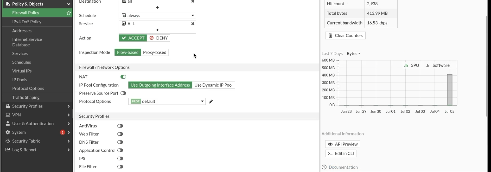

La segunda parte de SERVERS_TO_INTERNET muestra el modo flow-based, NAT activo y los perfiles de seguridad apagados. Esta regla se usa solo para salida básica de la red de servidores, separada de los controles aplicados a usuarios.

### Política que permite acceso web al servidor

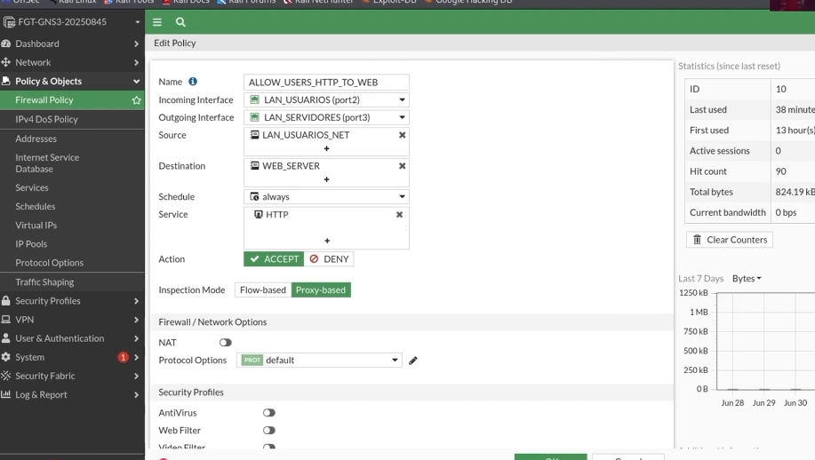

La política ALLOW_USERS_HTTP_TO_WEB permite tráfico desde LAN_USUARIOS_NET hacia el objeto WEB_SERVER por port3. En la captura se ven los servicios HTTP y  , acción ACCEPT, NAT deshabilitado y modo proxy-based. La regla limita el destino al servidor web y tiene aplicado el perfil WAF_WEB_SERVER_PROTECTION.

### Denegación del resto del tráfico hacia servidores

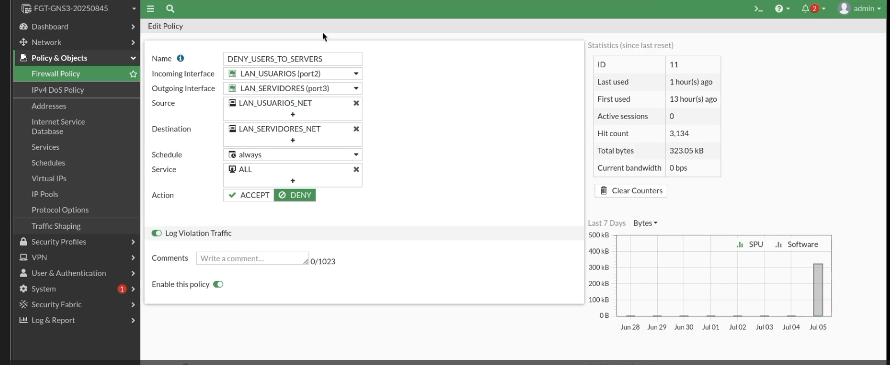

La política DENY_USERS_TO_SERVERS bloquea todo tráfico de LAN_USUARIOS_NET hacia LAN_SERVIDORES_NET que no sea permitido por una regla superior. La acción es DENY, el servicio es ALL y está habilitado el registro de tráfico de violación.

### Política de usuarios hacia Internet

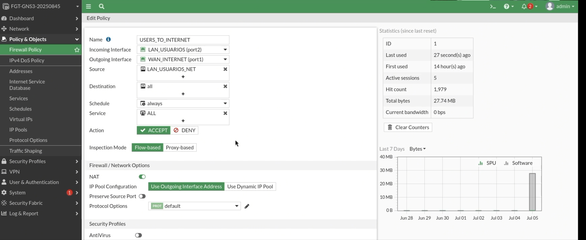

La política USERS_TO_INTERNET permite que LAN_USUARIOS_NET salga hacia WAN_INTERNET con servicio ALL y NAT habilitado. Esta regla es la base del acceso a Internet de usuarios y es donde se aplican los perfiles de Web Filter y Application Control.

## Bloqueo web, DNS y aplicaciones

### Perfil Web Filter para redes sociales

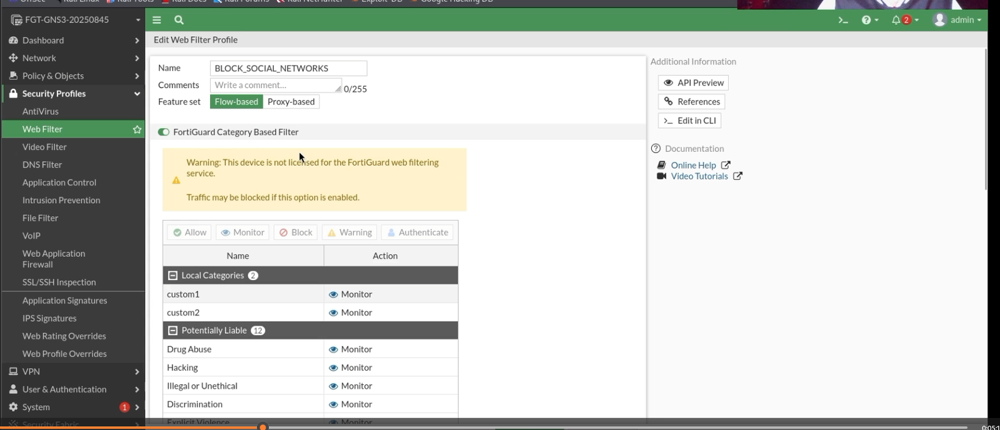

El perfil BLOCK_SOCIAL_NETWORKS aparece dentro de Security Profiles > Web Filter. La pantalla muestra la advertencia de licencia de FortiGuard, por lo que además del filtro por categoría se apoya el bloqueo con URL estáticas y DNS local.

### Categoría Social Networking bloqueada

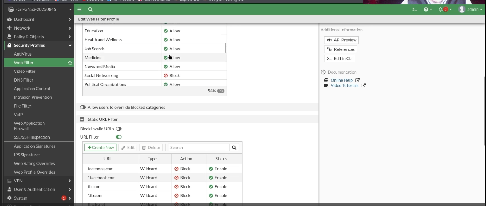

Dentro del perfil Web Filter se observa la categoría Social Networking con acción Block. Esta configuración representa el control por categoría para impedir el uso de redes sociales desde la LAN de usuarios.

### Filtro estático de URL para redes sociales

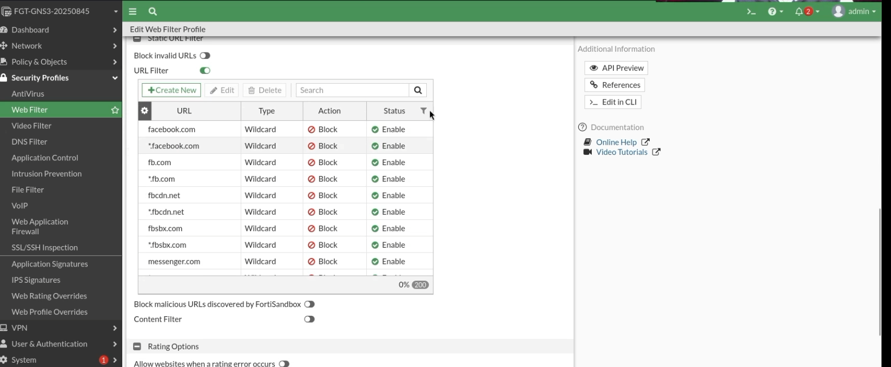

El Static URL Filter está habilitado y contiene dominios como facebook.com, *.facebook.com, fb.com, *.fb.com, fbcdn.net, *.fbcdn.net, fbsbx.com y messenger.com. Las entradas se muestran como wildcard, con acción Block y estado Enable.

### Perfil de Application Control para WhatsApp


La lista de Application Control muestra el perfil BLOCK_WHATSAPP_CALLS con referencia activa. Este perfil centraliza el control de aplicaciones relacionado con WhatsApp, principalmente para bloquear llamadas VoIP.

### Firma WhatsApp VoIP bloqueada


Dentro del sensor BLOCK_WHATSAPP_CALLS se observa una regla con la firma WhatsApp_VoIP.Call, tipo Application y acción Block. También se ve QUIC en Block, lo que ayuda a evitar que ciertas aplicaciones usen QUIC para evadir controles tradicionales.

### DNS Filter para itla.edu.do y subdominios


El perfil BLOCK_ITLA_DNS contiene un Static Domain Filter con itla.edu.do tipo simple y *.itla.edu.do tipo wildcard. Ambas entradas están configuradas como Redirect to Block Portal y están habilitadas.

### Portal de bloqueo al acceder a itla.edu.do

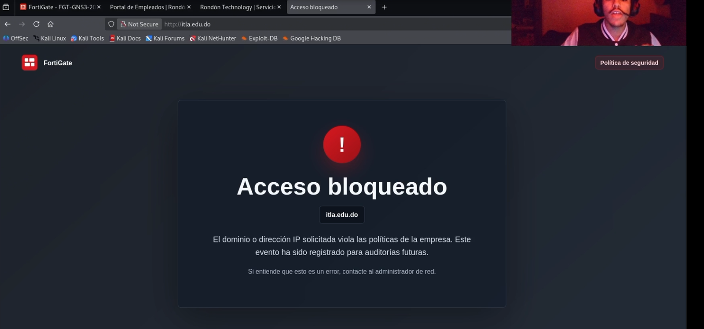

La navegación hacia itla.edu.do muestra el portal interno con el mensaje Acceso bloqueado. La página indica que el dominio o dirección solicitada viola las políticas de la empresa, validando la redirección del dominio bloqueado.

## Detección y bloqueo de escáneres

### Resumen de políticas IPv4 DoS

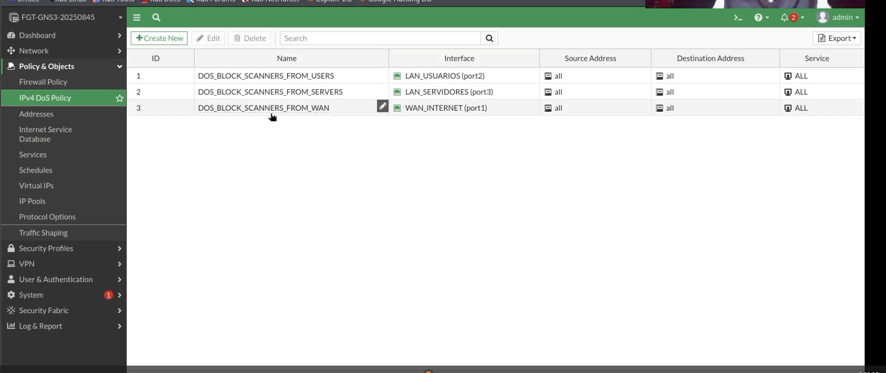

La sección IPv4 DoS Policy muestra tres políticas: DOS_BLOCK_SCANNERS_FROM_USERS en port2, DOS_BLOCK_SCANNERS_FROM_SERVERS en port3 y DOS_BLOCK_SCANNERS_FROM_WAN en port1. Esto evidencia protección para usuarios, servidores y zona WAN.

### DoS Policy para usuarios - inicio de anomalías

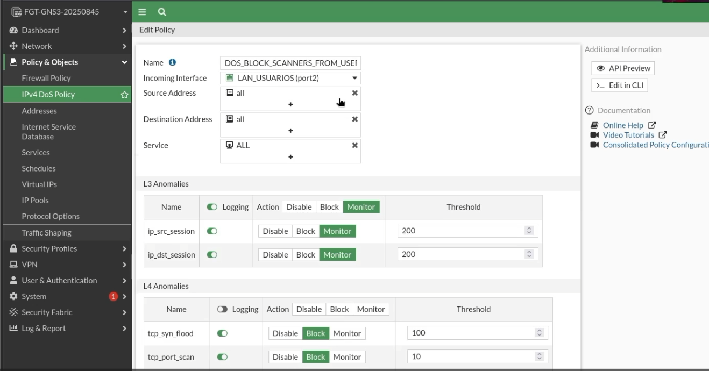

La política DOS_BLOCK_SCANNERS_FROM_USERS aplica sobre LAN_USUARIOS port2, con origen all, destino all y servicio ALL. En L3 se monitorean ip_src_session e ip_dst_session con umbral 200. En L4 se observan tcp_syn_flood y tcp_port_scan en Block.

### DoS Policy para usuarios - anomalías TCP, UDP e ICMP


La segunda vista muestra tcp_syn_flood, tcp_port_scan, udp_flood, udp_scan, icmp_flood e icmp_sweep con acción Block y umbrales definidos. Las sesiones por origen y destino quedan en Monitor para observar volumen anormal sin bloquear todo el tráfico legítimo.

### DoS Policy para usuarios - SCTP y sesiones

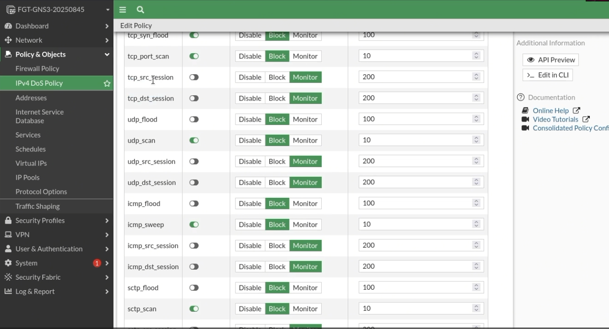

La tercera vista completa la política con anomalías adicionales como sctp_flood y sctp_scan en Block. También se observan controles de sesiones TCP, UDP, ICMP y SCTP en modo Monitor con umbral 200.

### DoS Policy aplicada en la WAN

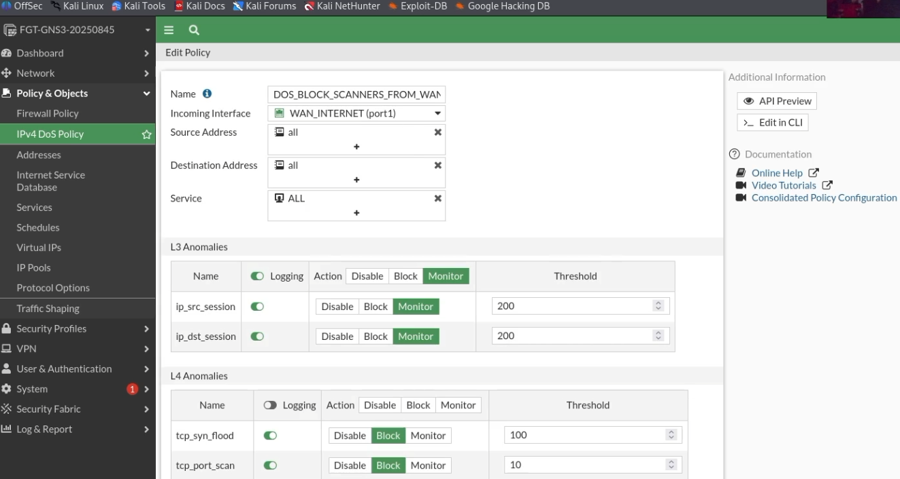

La política DOS_BLOCK_SCANNERS_FROM_WAN se aplica sobre WAN_INTERNET port1 con origen all, destino all y servicio ALL. Esta evidencia demuestra que el control de anomalías también contempla la zona externa.

### Escaneo Nmap hacia el servidor web


Desde Kali se ejecuta un escaneo SYN hacia 10.8.45.130. Esta prueba genera tráfico hacia múltiples puertos del Web Server y permite validar el bloqueo por política y la detección de comportamiento anómalo.

### Logs de Forward Traffic con denegación por política

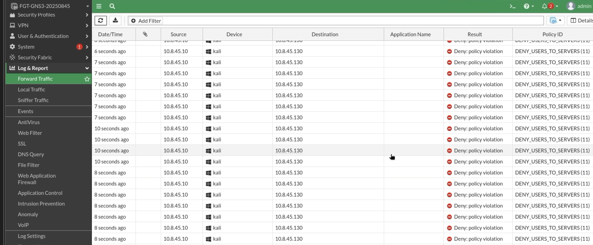

En Log & Report > Forward Traffic se observan múltiples eventos desde 10.8.45.10 hacia 10.8.45.130 con resultado Deny: policy violation. La columna Policy ID muestra DENY_USERS_TO_SERVERS (11), confirmando que el tráfico no permitido hacia servidores fue bloqueado.

### Escaneo Nmap hacia el gateway


La terminal muestra un escaneo SYN hacia 10.8.45.1, que corresponde al gateway de la LAN de usuarios en el FortiGate. Esta prueba se usó para generar tráfico de escaneo contra la propia interfaz del firewall y validar eventos de anomalía.

### Logs de anomalías por escaneo

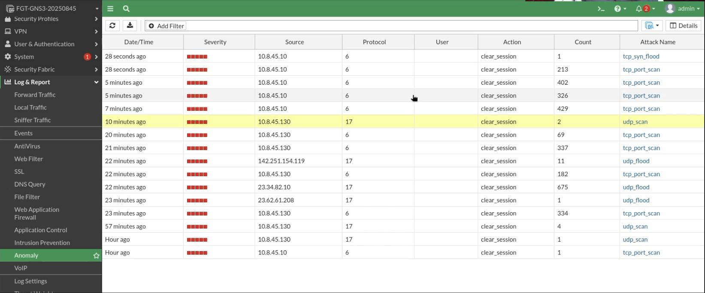

En Log & Report > Anomaly se observan eventos con severidad alta, acción clear_session y nombres de ataque como tcp_port_scan, tcp_syn_flood, udp_scan y udp_flood. Esto confirma que FortiGate detectó patrones de escaneo y cerró sesiones anómalas.

## Validación de acceso web permitido

### Portal de empleados permitido

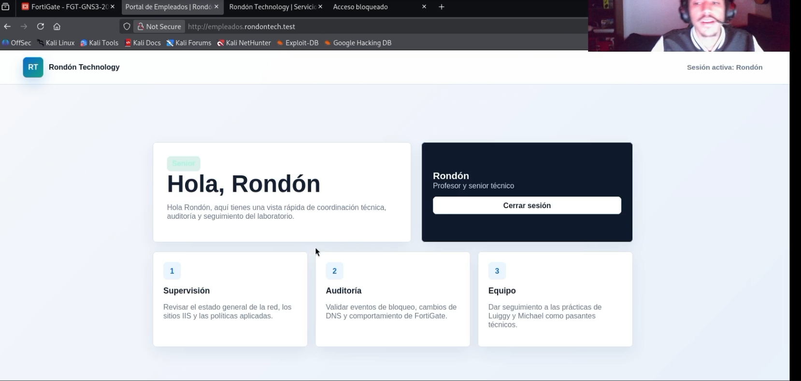

La página empleados.rondontech.test carga correctamente desde la estación de usuario. Se observa un portal interno de empleados de Rondón Technology, usado como evidencia de que el acceso web permitido hacia el servidor funciona.

### Sitio web público permitido


La página www.rondontech.test muestra el sitio principal de Rondón Technology. Esta prueba confirma que los usuarios pueden acceder al servicio web autorizado en el servidor 10.8.45.130.

## Web Application Firewall

### Perfil WAF con firmas principales


El perfil WAF_WEB_SERVER_PROTECTION contiene firmas habilitadas para Cross Site Scripting, SQL Injection, Generic Attacks, Trojans y Known Exploits con acción Block. También aparece Information Disclosure en Allow.

### WAF - firmas y primeros constraints

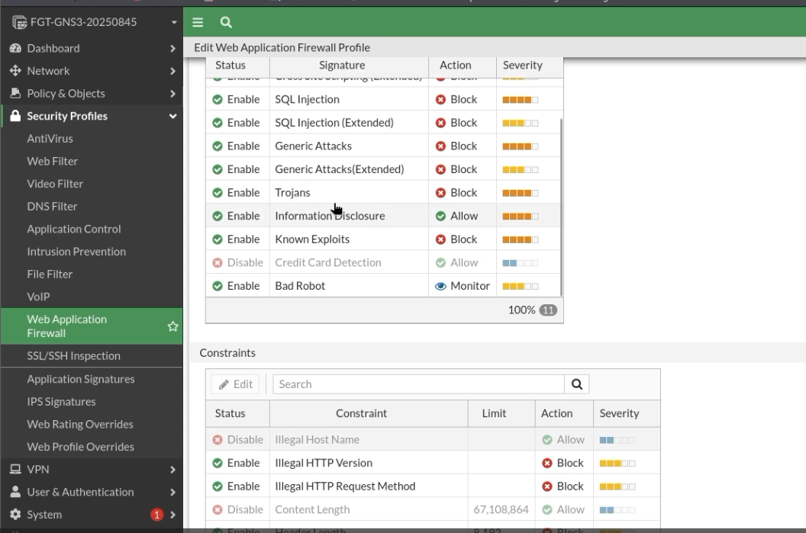

La segunda vista del WAF muestra el final de la lista de firmas, incluyendo Bad Robot en Monitor, y el inicio de los constraints. Se observan controles como Illegal HTTP Version e Illegal HTTP Request Method en Block.

### WAF - constraints avanzados

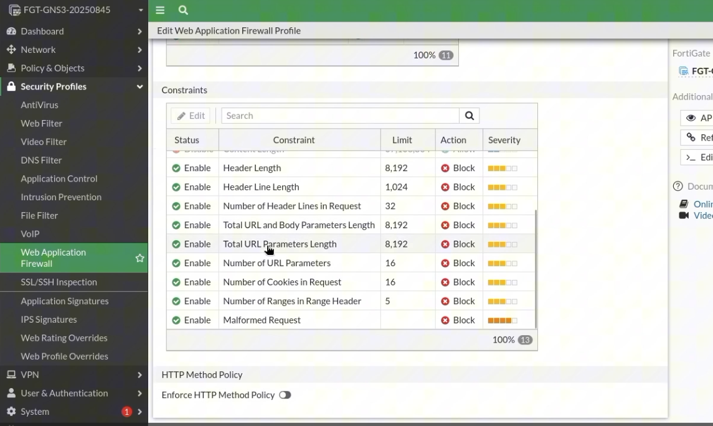

La sección de constraints avanzados bloquea condiciones como Header Length, Header Line Length, Number of Header Lines in Request, Total URL and Body Parameters Length, Number of URL Parameters, Number of Cookies in Request, Number of Ranges in Range Header y Malformed Request.

### Prueba web normal con HTTP 200

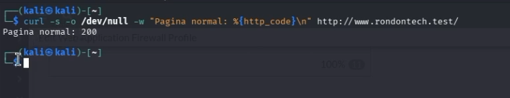

La terminal muestra una prueba normal hacia http://www.rondontech.test/ con resultado Página normal: 200. Esto confirma que el WAF no bloquea una solicitud legítima hacia el sitio web.

### WAF bloqueando ataque XSS en navegador

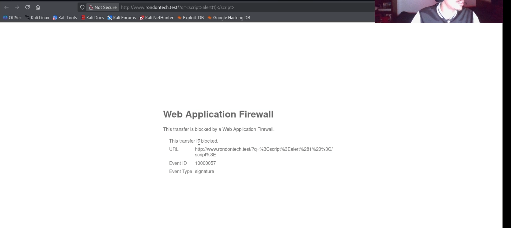

Al intentar acceder con una carga XSS basada en script alert(1), el navegador muestra la página Web Application Firewall. La evidencia incluye Event ID 10000057 y Event Type signature, indicando que el bloqueo fue producido por una firma del WAF.

## Conclusión

Las evidencias muestran una política corporativa completa: FortiGate separa las zonas del laboratorio, entrega DHCP a usuarios, enruta por WAN mediante ruta por defecto, aplica NAT, controla el tráfico entre usuarios y servidores, bloquea sitios no permitidos, redirige dominios restringidos al portal de bloqueo, registra intentos de escaneo y protege el servidor web con WAF ante ataques como XSS.
