# Fortigate Corporate Policies

Repositorio del laboratorio de políticas corporativas en **FortiGate Firewall** usando GNS3. El proyecto documenta, mediante imágenes de evidencia, la implementación de una red empresarial segmentada con salida a Internet, DHCP, NAT, control de acceso entre usuarios y servidores, bloqueo de redes sociales, bloqueo de llamadas de WhatsApp, bloqueo de dominios del ITLA, detección de escáneres de red y protección WAF para un servidor web interno.

La práctica fue realizada desde la interfaz gráfica de FortiGate, por lo que este repositorio se centra en el análisis visual de la configuración y en las pruebas realizadas, sin incluir scripts de configuración por CLI.

## Datos generales

| Campo | Valor |
|---|---|
| Autor | Michael David Robles Fermín |
| Matrícula | 2025-0845 |
| Asignatura | Seguridad de Redes |
| Plataforma | GNS3, FortiGate VM, Kali Linux y Windows Server/IIS |
| Repositorio | https://github.com/iClexi/Fortigate-Corporate-Policies |
| Video demostrativo | https://youtu.be/9Mjof5YxtKg?si=TpSuH9TQf1OwJGXo |
| Documentación técnica profesional | [docs/Documentación Técnica Profesional.pdf](docs/Documentaci%C3%B3n%20T%C3%A9cnica%20Profesional.pdf) |

## Documentación técnica profesional

La documentación técnica profesional del laboratorio está incluida dentro de la carpeta `docs` en formato PDF. Este archivo contiene el desarrollo completo de la práctica, con explicación detallada de la topología, direccionamiento, políticas de firewall, DHCP, NAT, filtros de seguridad, DNS, DoS Policy, WAF y pruebas realizadas.

[Ver documentación técnica profesional](docs/Documentaci%C3%B3n%20T%C3%A9cnica%20Profesional.pdf)

## Objetivo del laboratorio

El objetivo del laboratorio fue construir una red corporativa pequeña protegida por FortiGate, donde el firewall actúa como punto central de seguridad. La práctica valida que los usuarios puedan salir a Internet mediante NAT, que la red de servidores esté separada de la red de usuarios, que solo se permita tráfico web hacia el servidor, que los destinos no autorizados sean bloqueados o redirigidos, que los escaneos de red sean detectados y que el servidor web quede protegido mediante Web Application Firewall.

## Resumen de la solución implementada

La solución se divide en tres zonas principales. La primera zona es la WAN, conectada a Internet mediante `WAN_INTERNET (port1)`. La segunda zona es la LAN de usuarios, conectada por `LAN_USUARIOS (port2)`, donde se encuentra la máquina Kali usada para validar navegación, DNS, bloqueos y pruebas de escaneo. La tercera zona es la LAN de servidores, conectada por `LAN_SERVIDORES (port3)`, donde se encuentra el servidor web IIS.

El FortiGate administra el enrutamiento entre zonas, entrega DHCP a la red de usuarios, aplica NAT para la salida a Internet y controla el tráfico mediante políticas de firewall, perfiles de seguridad y políticas DoS.

## Topología del laboratorio

La topología muestra un FortiGate en el centro, conectado hacia Internet por la parte superior, hacia la red de usuarios por el lado izquierdo y hacia la red de servidores por el lado derecho. La estación de usuarios aparece como **Secretaria**, mientras que el servidor aparece como **WEB-SERVER**. Esta estructura permite demostrar segmentación, control de tráfico y aplicación de políticas corporativas desde un único punto de inspección.

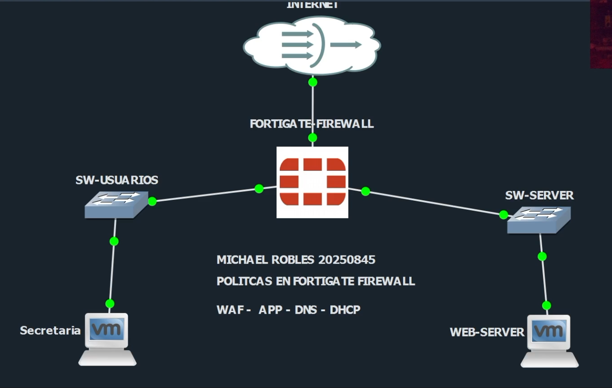

## Direccionamiento utilizado

| Elemento | Función | Dirección |
|---|---|---|
| `WAN_INTERNET (port1)` | Salida hacia Internet | 192.168.42.103/24 |
| Gateway WAN | Puerta de enlace hacia Internet | 192.168.42.1 |
| `LAN_USUARIOS (port2)` | Gateway de la red de usuarios | 10.8.45.1/25 |
| DHCP usuarios | Rango entregado por FortiGate | 10.8.45.20 a 10.8.45.120 |
| `LAN_SERVIDORES (port3)` | Gateway de la red de servidores | 10.8.45.129/28 |
| Kali / Secretaria | Cliente de prueba | 10.8.45.10/25 |
| Servidor IIS | Servidor web interno | 10.8.45.130/28 |

## Ruta por defecto

La ruta estática predeterminada permite que FortiGate envíe el tráfico desconocido hacia Internet. En la evidencia se observa el destino `0.0.0.0/0`, el gateway `192.168.42.1` y la interfaz de salida `WAN_INTERNET (port1)`. Esta ruta es necesaria para que las redes internas puedan alcanzar destinos externos cuando las políticas de firewall lo permitan.

## Interfaces del FortiGate

La vista de interfaces evidencia las tres conexiones principales del firewall. `WAN_INTERNET (port1)` obtiene una dirección de la red 192.168.42.0/24. `LAN_USUARIOS (port2)` tiene la dirección 10.8.45.1/25 y funciona como gateway de la red de usuarios. `LAN_SERVIDORES (port3)` tiene la dirección 10.8.45.129/28 y funciona como gateway de la red donde reside el servidor web.

## Configuración de la red de usuarios

La interfaz `LAN_USUARIOS (port2)` está configurada en modo manual con la dirección 10.8.45.1 y máscara 255.255.255.128. Esta máscara corresponde a una red /25, lo que define la LAN de usuarios como 10.8.45.0/25. En la sección de acceso administrativo se observan servicios como HTTPS, HTTP, SSH y PING, usados durante el laboratorio para administrar y validar el FortiGate desde la red interna.

En la segunda parte de la configuración de `port2` se observa el servidor DHCP habilitado. El rango asignado va desde 10.8.45.20 hasta 10.8.45.120, con máscara 255.255.255.128. También se especifica como servidor DNS la IP 10.8.45.1, es decir, el propio FortiGate. Esto permite que el firewall controle la resolución DNS interna, incluyendo dominios permitidos, dominios bloqueados y redirecciones hacia el portal de bloqueo.

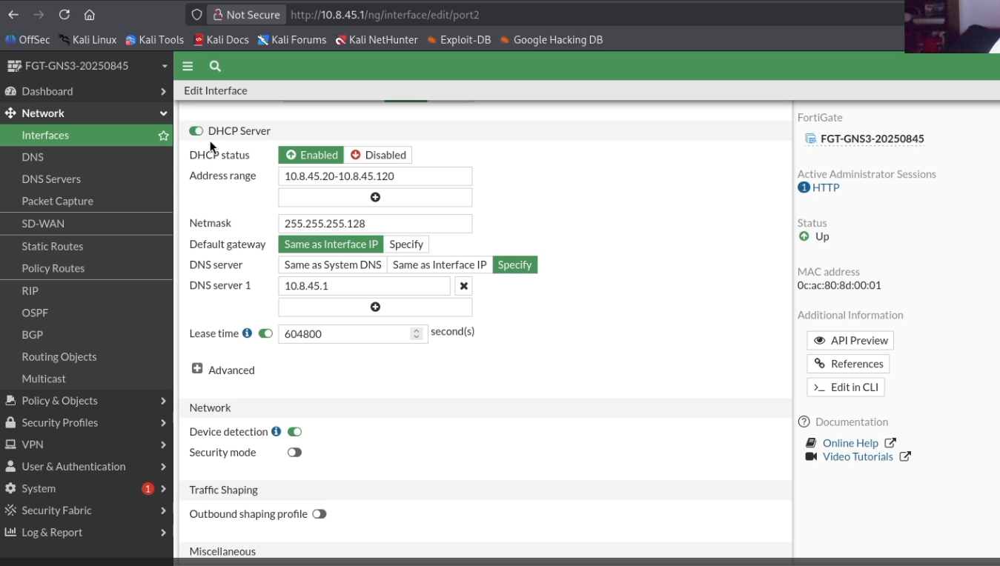

## Políticas de firewall

Las políticas de firewall definen qué tráfico puede pasar entre las zonas. En la vista general se observan las reglas principales del laboratorio: salida de servidores hacia Internet, acceso HTTP/HTTPS desde usuarios hacia el servidor web, denegación del resto del tráfico hacia servidores y salida de usuarios hacia Internet con perfiles de seguridad aplicados.

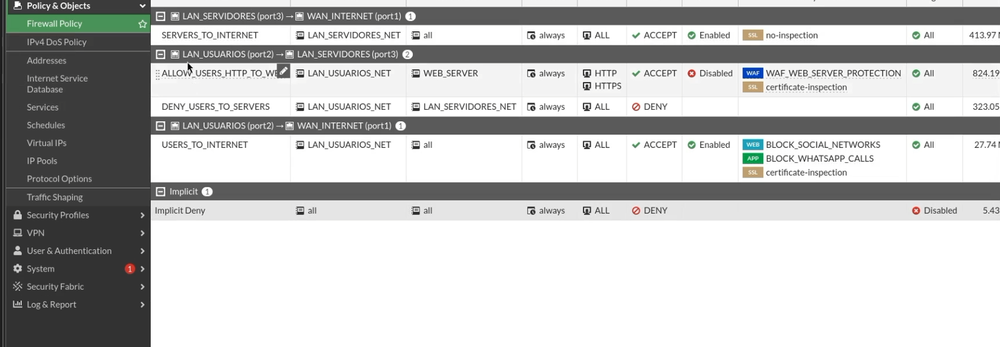

## Salida de servidores hacia Internet

La política **SERVERS_TO_INTERNET** permite que la red de servidores salga hacia Internet. La interfaz de entrada es `LAN_SERVIDORES (port3)` y la interfaz de salida es `WAN_INTERNET (port1)`. El origen es `LAN_SERVIDORES_NET`, el destino es `all`, el servicio es `ALL` y la acción es `ACCEPT`. Esta regla tiene NAT habilitado, lo que permite que el tráfico de los servidores use la dirección de salida del FortiGate.

La segunda imagen confirma la sección de opciones de red de la política, donde se muestra NAT activo usando la dirección de la interfaz de salida. También se observan contadores de uso, sesiones activas y tráfico generado, lo que demuestra que la regla ha sido utilizada.

## Acceso permitido hacia el servidor web

La política **ALLOW_USERS_HTTP_TO_WEB** permite tráfico desde `LAN_USUARIOS (port2)` hacia `LAN_SERVIDORES (port3)`, con origen `LAN_USUARIOS_NET` y destino `WEB_SERVER`. En la evidencia se observan los servicios HTTP y HTTPS permitidos hacia el servidor web y el modo de inspección proxy. También se muestra el perfil **WAF_WEB_SERVER_PROTECTION** aplicado, lo que significa que el tráfico web hacia el servidor es inspeccionado por el Web Application Firewall.

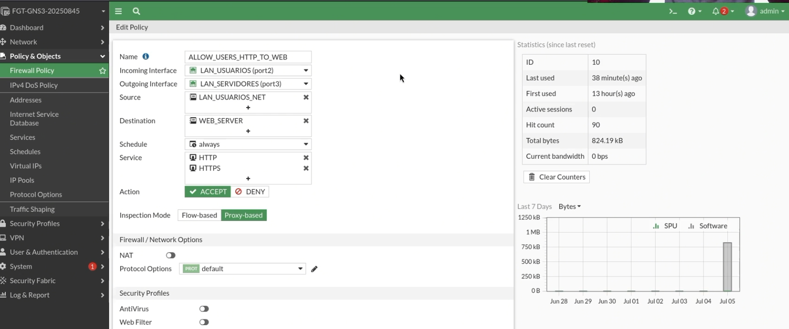

## Bloqueo del resto del tráfico hacia servidores

La política **DENY_USERS_TO_SERVERS** bloquea todo tráfico desde la red de usuarios hacia la red de servidores que no haya sido permitido previamente. Su origen es `LAN_USUARIOS_NET`, su destino es `LAN_SERVIDORES_NET`, el servicio es `ALL` y la acción es `DENY`. Esta regla es importante porque limita el acceso de los usuarios únicamente al tráfico autorizado hacia el servidor web.

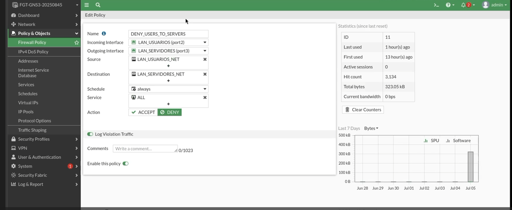

## Salida de usuarios hacia Internet

La política **USERS_TO_INTERNET** permite que los usuarios salgan hacia Internet desde `LAN_USUARIOS (port2)` hacia `WAN_INTERNET (port1)`. El origen es `LAN_USUARIOS_NET`, el destino es `all`, el servicio es `ALL` y NAT está habilitado. En esta política también se aplican perfiles de seguridad como Web Filter y Application Control, usados para bloquear redes sociales y llamadas de WhatsApp.

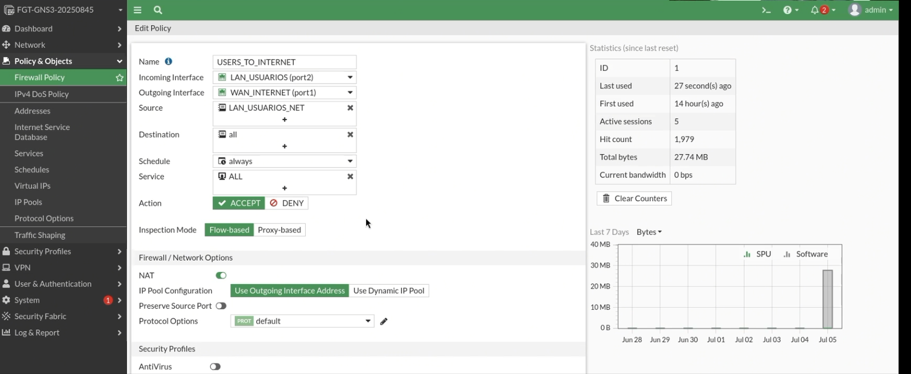

## Bloqueo de redes sociales

El perfil **BLOCK_SOCIAL_NETWORKS** se usa para controlar navegación hacia redes sociales. En la evidencia se muestra el perfil Web Filter con filtrado basado en categorías de FortiGuard. Aunque el equipo no tiene licencia FortiGuard activa, el perfil queda documentado como parte de la política corporativa y se complementa con filtros estáticos de URL.

En la categoría de filtrado se observa **Social Networking** con acción **Block**. Esta configuración representa la política de la empresa para impedir navegación hacia plataformas sociales desde la red de usuarios.

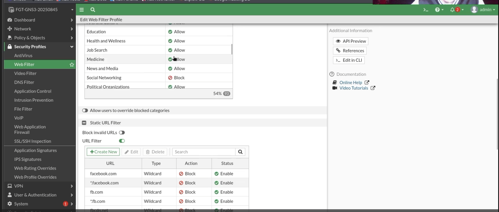

El filtro estático de URLs contiene dominios específicos como `facebook.com`, `*.facebook.com`, `fb.com`, `*.fb.com`, `fbcdn.net`, `*.fbcdn.net`, `messenger.com` y otros dominios relacionados. Cada entrada aparece con tipo Wildcard, acción Block y estado Enable. Esta parte permite reforzar el bloqueo sin depender únicamente de la clasificación por categoría.

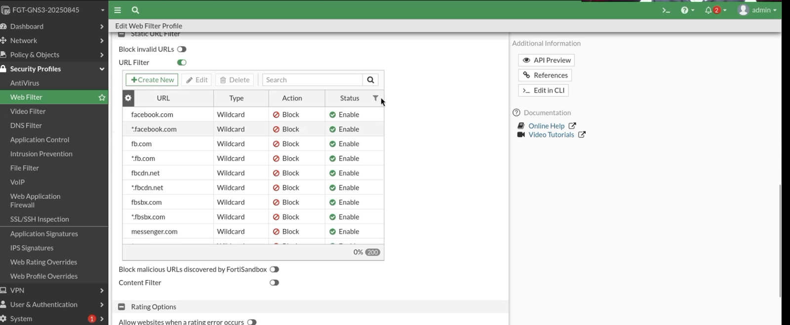

## Bloqueo de llamadas de WhatsApp

El perfil **BLOCK_WHATSAPP_CALLS** aparece creado en Application Control y referenciado por una política. Este perfil se usa para controlar aplicaciones, no solo dominios. Su objetivo es bloquear tráfico asociado a llamadas de WhatsApp y reducir la posibilidad de evasión mediante aplicaciones que no dependen únicamente del navegador.

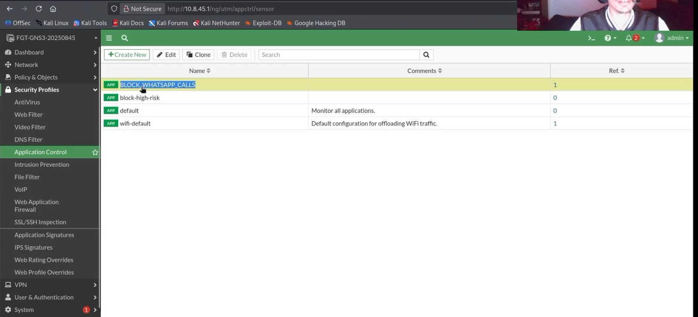

Dentro del perfil se observa un override para **WhatsApp_VoIP.Call** con acción **Block**. También se visualiza QUIC en estado Block, lo cual ayuda a reducir tráfico cifrado moderno que puede dificultar la inspección. Esta configuración demuestra control de aplicación sobre tráfico relacionado con llamadas de WhatsApp.

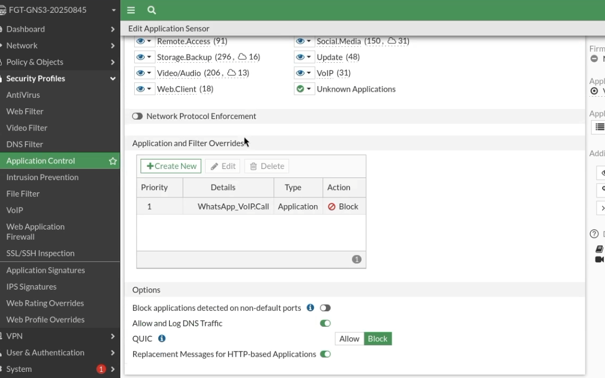

## Bloqueo de itla.edu.do y subdominios

El perfil **BLOCK_ITLA_DNS** usa DNS Filter para redirigir `itla.edu.do` y `*.itla.edu.do` hacia un portal interno. En la tabla se observa el dominio principal como tipo simple y el wildcard como tipo wildcard, ambos con acción **Redirect to Block Portal** y estado Enable. Esta configuración cumple el objetivo de bloquear el dominio base y sus subdominios.

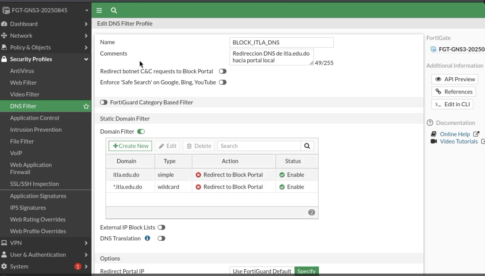

Al intentar acceder a `http://itla.edu.do`, el navegador muestra un portal con el mensaje **Acceso bloqueado**. La página indica que el dominio o dirección IP solicitada viola las políticas de la empresa y que el evento fue registrado para auditorías futuras. Esta evidencia valida que el bloqueo no solo existe en la configuración, sino que también se refleja en la experiencia del usuario final.

## Políticas DoS contra escáneres de red

La vista de IPv4 DoS Policy muestra tres políticas: **DOS_BLOCK_SCANNERS_FROM_USERS**, **DOS_BLOCK_SCANNERS_FROM_SERVERS** y **DOS_BLOCK_SCANNERS_FROM_WAN**. Estas políticas cubren tráfico proveniente de la red de usuarios, la red de servidores y la interfaz WAN. Su objetivo es detectar comportamientos anómalos como escaneos de puertos, barridos ICMP y floods.

En la política **DOS_BLOCK_SCANNERS_FROM_USERS** se observa que la interfaz de entrada es `LAN_USUARIOS (port2)`, con origen `all`, destino `all` y servicio `ALL`. En las anomalías L3 aparecen controles de sesiones por origen y destino en modo Monitor con umbral 200. En las anomalías L4 se observan controles como `tcp_syn_flood` y `tcp_port_scan`, con acción Block y umbrales definidos.

La segunda parte de la política muestra anomalías adicionales como `udp_flood`, `udp_scan`, `icmp_flood` e `icmp_sweep`. Las opciones de escaneo y flood están configuradas con acción Block, y varias tienen logging activo para registrar eventos en FortiGate.

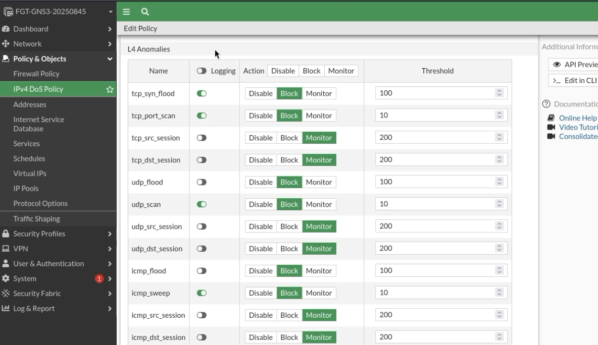

La tercera parte continúa con anomalías como `sctp_flood` y `sctp_scan`, junto con controles de sesión. Esto demuestra que la política no se limita a TCP, sino que también contempla UDP, ICMP y SCTP.

La política **DOS_BLOCK_SCANNERS_FROM_WAN** aplica controles similares desde la interfaz `WAN_INTERNET (port1)`. Esto protege al firewall ante tráfico anómalo originado desde la red externa.

## Pruebas de escaneo y registros

La prueba de escaneo al servidor web se realizó desde Kali hacia 10.8.45.130. Esta evidencia muestra el inicio del escaneo y sirve para generar tráfico anómalo que pueda ser registrado por FortiGate.

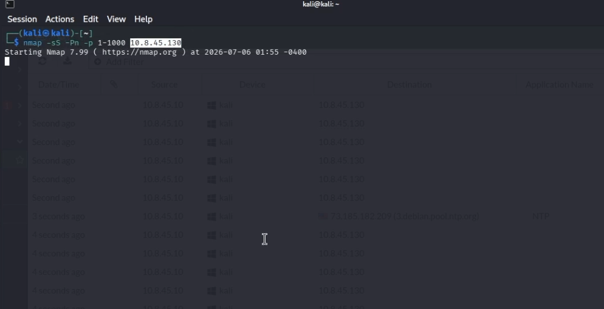

En los registros de Forward Traffic se observan múltiples eventos desde 10.8.45.10 hacia 10.8.45.130 con resultado **Deny: policy violation** y política **DENY_USERS_TO_SERVERS (11)**. Esto confirma que el tráfico no autorizado hacia la red de servidores fue bloqueado por la política de firewall.

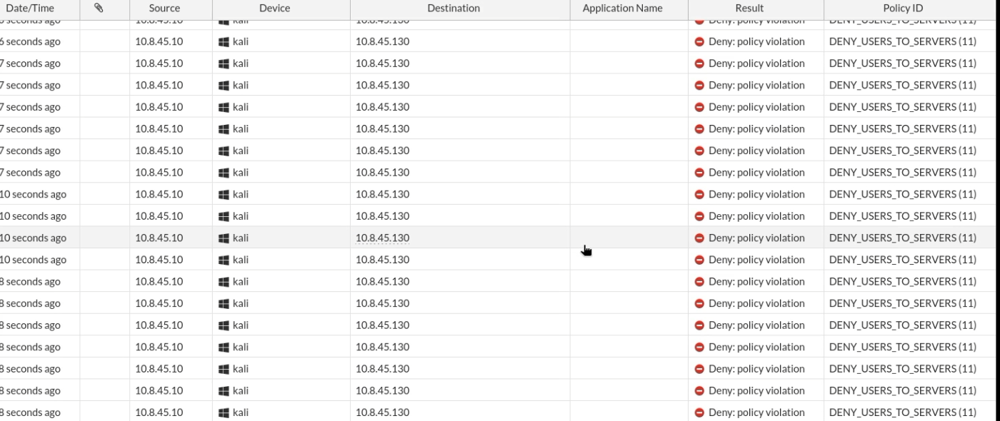

La prueba de escaneo hacia el gateway permitió generar eventos adicionales en el propio FortiGate. Esta prueba sirve para evidenciar que el firewall también registra comportamientos anómalos dirigidos contra sus interfaces.

En los logs de **Anomaly** se observan eventos como `tcp_port_scan`, `tcp_syn_flood`, `udp_scan` y `udp_flood`, con acción **clear_session**. También se observan conteos elevados asociados a la IP 10.8.45.10 y a otros destinos. Esto demuestra que las políticas DoS están detectando patrones de escaneo y generando eventos de seguridad.

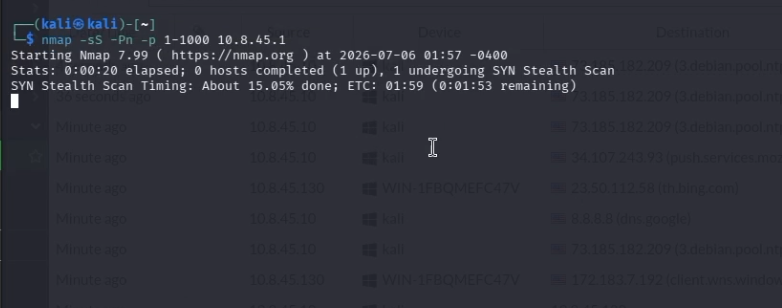

## Servidor web interno

El servidor web IIS publica una página interna de empleados bajo el dominio `empleados.rondontech.test`. La página muestra un portal de coordinación técnica, auditoría y seguimiento del laboratorio. Esta evidencia confirma que el servidor web responde correctamente desde la red de usuarios cuando el tráfico está permitido.

También se publica el sitio principal `www.rondontech.test`, con una página corporativa de Rondón Technology. Esta segunda página permite validar que el servidor puede alojar más de un sitio y que la política HTTP/HTTPS hacia el servidor funciona.

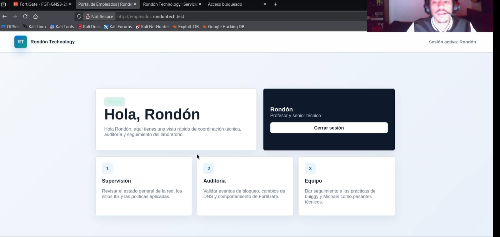

## Web Application Firewall

El perfil **WAF_WEB_SERVER_PROTECTION** se aplica al servidor web 10.8.45.130 para bloquear ataques web comunes. En la lista de firmas se observan protecciones habilitadas contra Cross Site Scripting, SQL Injection, Generic Attacks, Trojans y Known Exploits. La mayoría de estas firmas están en acción Block, por lo que el FortiGate puede interrumpir solicitudes maliciosas antes de que lleguen al servidor IIS.

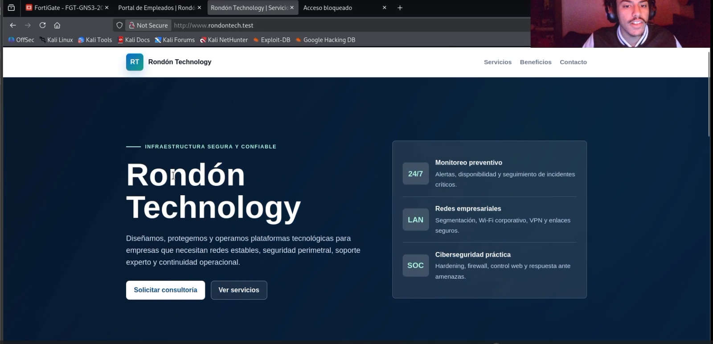

En la segunda vista del WAF se observa que **Information Disclosure** está permitido y **Bad Robot** está en modo Monitor. Esto evita bloquear tráfico normal por comportamiento de cliente, pero permite observar actividad sospechosa. También se visualiza el inicio de la sección de constraints, donde se controlan propiedades de las solicitudes HTTP.

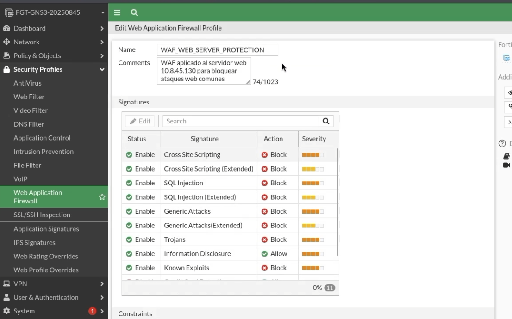

La sección de constraints muestra límites para Header Length, Header Line Length, número de líneas de encabezado, longitud total de parámetros, cantidad de parámetros, cookies, rangos en encabezado y solicitudes malformadas. Las acciones configuradas en Block ayudan a detener peticiones anómalas o manipuladas.

## Pruebas del WAF

La prueba de página normal muestra respuesta **Página normal: 200**. Esto indica que el WAF no bloquea tráfico legítimo hacia el servidor web.

La prueba de XSS muestra una página generada por el Web Application Firewall. En ella se indica que la transferencia fue bloqueada por el WAF, se muestra la URL con el patrón de ataque y aparece el Event ID 10000057 con Event Type signature. Esta evidencia confirma que el perfil WAF bloquea ataques de Cross Site Scripting.

## Estructura del repositorio

- `README.md`: explicación principal del laboratorio y análisis de imágenes.
- `docs/Documentación Técnica Profesional.pdf`: documentación técnica profesional del laboratorio en formato PDF.
- `images/`: capturas organizadas por tema y en orden técnico.

## Conclusión

El laboratorio demuestra una implementación funcional de políticas corporativas en FortiGate. La red queda segmentada en WAN, usuarios y servidores. Los usuarios tienen salida a Internet mediante NAT, el servidor web recibe únicamente el tráfico permitido, los dominios no autorizados son bloqueados o redirigidos, WhatsApp VoIP queda controlado por Application Control, los escaneos generan eventos de seguridad y el servidor IIS queda protegido por WAF frente a ataques como XSS.
